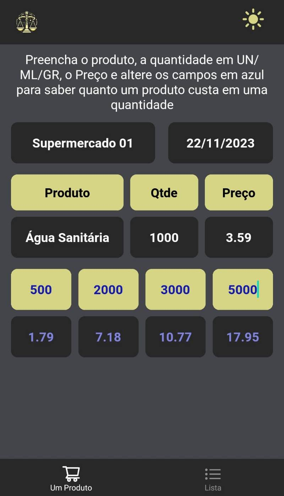
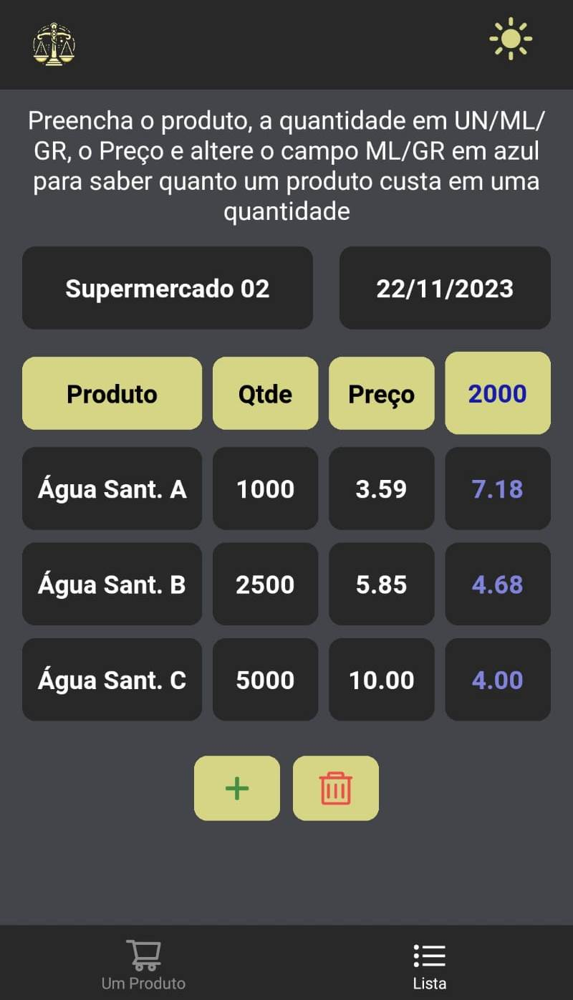

#  Price Compare App

Aplicativo React Native para comparar preços de produtos.


 

## 🔧 Tecnologias/Ferramentas Utilizadas


## 📚 Descrição do Projeto

O principal objetivo deste projeto foi desenvolver um aplicativo em React Native simples, para calcular preços de produtos de acordo com a quantidade fornecida pelo usuário. Mostrando a diferença do valor de um produto em diferentes quantidades para que seja possível identificar qual o melhor custo/benefício.

## 🎯 Funções

- Cálculo de um produto com várias quantidades possíveis;
- Cálculo de vários produtos, com várias quantidades e valores distintos.

## 👥 Contribuição

Caso deseje contribuir para este projeto, siga os passos abaixo:

1. Faça um fork do repositório;

2. Crie um branch para a sua feature :
   ```
   git checkout -b feature/nome-da-feature
   ```
3. Faça as alterações desejadas;

4. Commit suas mudanças:

   ```
   git commit -m 'Adicionando nova feature'
   ```

5. Push o branch:

   ```
   git push origin feature/nome-da-feature
   ```

6. Abra um Pull Request;
